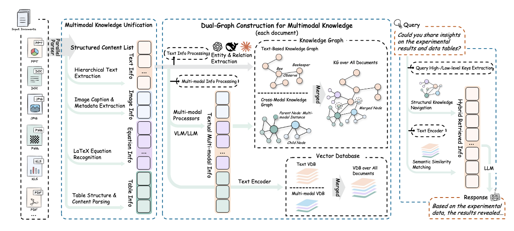
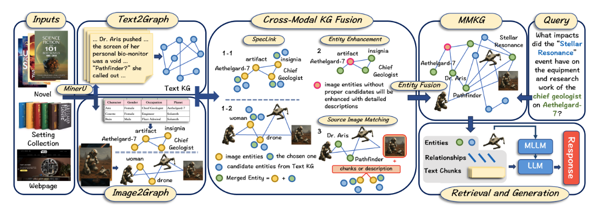

# 15 分鐘 Paper 分享：五篇多模態 RAG 論文

---

## Paper 1｜ColPali（2024）

### 當前問題

現有文件檢索系統依賴**複雜的前處理管線**（OCR → 版面偵測 → 文字切塊 → 嵌入），這個流程本質上是在把視覺文件「壓縮成純文字」，導致：

- 圖表、表格、頁面排版等**視覺線索直接被丟棄**
- OCR 和版面偵測本身就是誤差來源，錯一步全盤皆輸
- 索引建立速度極慢（captioning 策略每頁可能耗時數十秒）

### 研究問題

> **能不能跳過文字提取，直接把「文件頁面的圖像」嵌入成向量，用視覺特徵做檢索？**

### 解決範圍

頁面級文件檢索（PDF、科學論文、簡報等視覺豐富文件），同時兼顧檢索準確率、查詢延遲與索引吞吐量三個工業需求。

### 解法與亮點

**核心架構：ColPali = VLM（PaliGemma-3B）+ ColBERT 延遲互動**

傳統做法需要整條前處理管線才能把文件「餵給」嵌入模型；ColPali 的核心想法是：**既然 VLM 本來就能看懂圖，為什麼不直接把頁面當圖片輸入？**

**索引階段（離線）**

把整頁文件截圖作為圖像輸入 PaliGemma-3B，VLM 會把頁面切成多個 image patch，每個 patch 產生一個 token 嵌入向量，存到索引中。頁面有多少個 patch，就有多少個向量，**每個向量對應頁面的一個局部區域**，保留了空間位置資訊。

**查詢階段（線上）**

文字查詢同樣輸入同一個 VLM，產生 query token 嵌入序列。

**匹配：延遲互動（Late Interaction）**

借鑑 ColBERT 的思路，不是把整頁壓成一個向量再比較，而是讓每個 query token 去「掃描」文件的所有 patch 嵌入，找到最相似的那個，再把所有 query token 的最高分加總：

$$LI(q,d) = \sum_{i} \max_{j} \langle E_q(i) \mid E_d(j) \rangle$$

這樣的好處是：查詢中的每個詞都能對應到頁面最相關的局部區域（例如「表格第三欄」、「左下角圖表」），比單向量匹配細緻得多，同時又比交叉編碼器（cross-encoder）快，因為文件嵌入可以**預先計算並快取**。

**訓練**：用批次內對比損失（in-batch contrastive loss），正樣本是查詢對應的正確頁面，負樣本是同一批次的其他頁面，完全端對端微調。

**亮點**：
- 完全跳過 OCR、版面偵測、captioning——**索引速度比 Captioning 方案快 100 倍以上**，準確率還更高
- VLM 在預訓練時已建立文字與圖像 patch 之間的對齊，微調成本低
- 同步釋出評測基準 **ViDoRe**（頁面級文件檢索，涵蓋醫療、商業、科學等領域，含圖表、表格、資訊圖等多種視覺元素）

---

## Paper 2｜VLM2Vec-V2（2025）

### 當前問題

先釐清這篇的定位：**VLM2Vec-V2 的目標是訓練一個通用多模態 Embedding Model**，不是生成式問答模型。它要把各種視覺輸入壓縮成固定維度的向量，讓語意相近的輸入在向量空間中距離也近，供檢索、分類等下游任務使用。

現有方法面臨三個核心障礙：

1. **模態異質性**：文字是離散序列、圖是像素網格、影片有時序維度，傳統做法是替每個模態訓練獨立模型，難以跨模態比較與擴展
2. **任務多樣性**：同樣是「圖 + 文字」輸入，圖文檢索和圖像分類需要不同的嵌入表示，模型不知道「現在要做什麼」
3. **模態覆蓋不足**：現有模型幾乎只支援靜態圖像，對**影片**（時序）和**視覺文件**（PDF/簡報版面）支援極差

### 研究問題

> **如何把一個生成式 VLM 改造成統一的多模態 Embedding Model，讓它靠自然語言指令區分任務意圖，同時支援圖像、影片、視覺文件三種視覺模態？**

### 解決範圍

文字、圖像、影片、視覺文件四種輸入模態的統一嵌入，覆蓋檢索、分類、問答等多種任務形式（共 78 個資料集）。

### 解法與亮點

**兩大貢獻並行推出：**

**① MMEB-V2 評測基準**

在原有 MMEB（圖像 + 文字）基礎上，新增五種任務：

| 任務 | 說明 |
|---|---|
| 影片檢索（V-RET） | 文字描述 → 從數千部影片中找正確影片 |
| 片段檢索（M-RET） | 文字 → 找影片中正確的時間段（約 10 個候選段落） |
| 影片分類（V-CLS） | 影片 → 預測場景/動作類別 |
| 影片問答（V-QA） | 影片 + 問題 → 多選答案 |
| 視覺文件檢索（VisDoc） | 文字查詢 → 找正確的 PDF/簡報頁面 |

**② VLM2Vec-V2 嵌入模型**

**Backbone：Qwen2-VL——必要但不充分**

選用 Qwen2-VL 解決了「輸入端」的問題：Naive Dynamic Resolution 處理不同解析度輸入、M-RoPE 捕捉空間與時序結構、統一 2D/3D 卷積讓圖像與影片一套架構處理。

但 Qwen2-VL 本身是生成式模型（預測下一個 token），不會自動產生「語意相近就距離近」的向量空間，也不知道「現在在做檢索還是分類」。Backbone 只是地基，還需要訓練方法補足。

**如何把生成模型變成嵌入模型：取最後一個 token**

把輸入餵進 Qwen2-VL 後，取**最後一層、最後一個 token 的向量**作為整段輸入的嵌入。原因：Qwen2-VL 是 causal attention 架構，最後一個 token 已「看過」前面所有 token，理論上融合了整段輸入的完整語意。

**雙塔架構（Dual-Encoder）**

Query 和 Target **各自獨立跑 forward pass**，不是 concat 在一起：

```
[指令 + query 內容] → Qwen2-VL → 取最後 token → h_q
[target 內容]       → Qwen2-VL → 取最後 token → h_t
```

這樣 target 可以**預先離線編碼存成向量資料庫**，查詢時只算 cosine similarity，速度極快。（若 concat 在一起就是 cross-encoder，每次查詢都要重跑，無法預計算。）

**指令引導對比訓練（InfoNCE Loss）**

對比訓練讓嵌入空間具備「語意相近則距離近」的性質。Query 前加自然語言指令告訴模型當前任務：

$$\mathcal{L} = -\log \frac{\varphi(h_q^{inst}, h_{t^+})}{\varphi(h_q^{inst}, h_{t^+}) + \sum_{t^- \in \mathcal{N}} \varphi(h_q^{inst}, h_{t^-})}, \quad \varphi(h_q, h_t) = \exp\!\left(\tfrac{1}{\tau}\cos(h_q, h_t)\right)$$

本質是「把找正確 target 當成多分類問題」，softmax 後讓正確答案的機率最高：

- **In-batch negatives**：同一 batch 內其他樣本的 target 自動充當負樣本，batch size = B 就免費得到 B-1 個負樣本
- **Hard negatives**：刻意挑選「容易混淆」的樣本，逼模型學細緻的語意區分
- 梯度同時「拉近正確配對」、「推遠所有負樣本」，雕塑出有語意意義的嵌入空間

**影片與挑戰**：均勻取樣成幀序列整體輸入，保留時序覆蓋。片段檢索（M-RET）特別難——模型要從 10 個候選時間段找出匹配段落，真正需要理解時序而非只看靜態畫面。

- 在 78 個資料集上超越所有先前 baseline
- 單一模型靠指令切換任務行為，不需為每種任務部署獨立模型
- MMEB-V2 本身也是貢獻——過去沒有能同時評估四種視覺模態的標準化基準

---

## Paper 3 & 4｜RAG-Anything ＋ MMGraphRAG（2025）

> 這兩篇放在一起講，因為解決的問題完全一致，且互為對方的 baseline。

### 當前問題

傳統 RAG／GraphRAG 系統**只能處理純文字**，但真實世界的文件（學術論文、財報、新聞、法律文件等）本質上是**多模態**的，同時包含文字、圖片、表格、公式等內容。

這造成了共同的核心痛點：

- 現有系統要嘛**捨棄非文字資訊**，要嘛**把圖表硬轉成文字描述**，導致資訊嚴重流失
- 無法回答「需要看圖 / 看表才能回答」的問題（例如：比較圖表中哪個模型表現較好、財報表格中特定欄位的數值）
- 在**長文件**（100 頁以上）場景下，相關證據分散在不同模態與不同段落，傳統文字檢索難以定位

> 兩篇論文都選擇「建立能融合文字與視覺資訊的知識圖譜」這條路線，並且使用**相同的評測基準**（DocBench、MMLongBench），甚至互為對方論文中的比較 baseline。

---

### 兩篇論文的解決概念、範圍與解法

#### 3.1 RAG-Anything（HKU, 2025）

**核心概念**：把所有模態（文字/圖片/表格/公式）都當作「原子知識單元」，用**雙圖架構**統一表示，再做跨模態混合檢索。

**涵蓋範圍**：文字、圖片、表格、公式 —— **全模態**，範圍最廣。

**解法（三階段）**：

**① 知識統一化（Multimodal Knowledge Unification）**

用 MinerU 解析器把文件拆成「原子知識單元」$c_j = (t_j, x_j)$，其中 $t_j$ 是模態類型（文字/圖/表/公式），$x_j$ 是原始內容。對每個非文字 unit，系統會：
- 用 VLM 生成兩種描述：**詳細描述**（給語意理解用）和**實體摘要**（給圖譜抽取用）
- 同時考慮**上下文鄰域**（例如圖片旁的 caption 段落），讓描述更精準

**② 雙圖構建（Dual-Graph Construction）—— 核心創新**

同時建立兩張知識圖：
- **Cross-Modal KG**：以非文字 unit 為節點，用 VLM 生成的描述抽取實體關係，保留結構關聯（如 `表格header → belongs_to → 表格cell`、`圖表panel → described_by → caption`）
- **Text-based KG**：對純文字段落沿用 LightRAG/GraphRAG 的傳統做法抽取實體關係

最後透過**實體對齊**（entity alignment，以實體名稱為主鍵）把兩張圖合併成統一圖譜 $G$，並同步建立向量嵌入表 $T$。

**③ 跨模態混合檢索（Cross-Modal Hybrid Retrieval）**

檢索走**雙路並行**策略：
- **結構化導航**：在知識圖上做多跳關係推理，擅長找「有明確結構連結」的證據（如沿著 `belongs_to` 邊從表格 cell 追到整張表格）
- **語義相似度匹配**：向量檢索，擅長找「語意相關但沒有直接結構邊」的內容

兩路結果合併後做多訊號融合排序，最終對視覺 chunk 做 **dereferencing**（把原始圖片找回來），交給 VLM 同時參考「文字上下文 + 原始圖像」生成答案。

**特點**：創新分布在「索引建構」與「檢索」兩端；特別擅長**長文件**與**結構複雜的表格/多面板圖**（案例顯示能正確定位表格行列交叉點、辨識多面板圖中的正確子圖）。

---

#### 3.2 MMGraphRAG（HIT & NTU, 2025）

**核心概念**：把圖像轉成 **Scene Graph**（場景圖），再透過一個專門設計的**跨模態實體連結方法 SpecLink**，將圖像實體與文字實體對齊融合成統一的 MMKG。

**涵蓋範圍**：主要聚焦**文字＋圖像**兩種模態（表格、公式仍當作純文字處理，未特別建模）。

**解法（核心是 CMEL 任務）**：

**① Image2Graph**

先用 YOLO 對圖片做語意分割，切出各個視覺區塊（人物、物件、場景元素），再用 MLLM 為每個區塊生成文字描述，從描述中抽取實體與關係。這裡有個細節：抽取的關係不只有顯性關係（例如「A 拿著 B」），也包含 MLLM 推斷的**隱含關係**（例如「兩人靠得很近，可能是情侶」），讓圖像的語意更豐富。最後再建立一個「全域圖像實體」代表整張圖，與局部區塊形成階層結構。

**② Text2Graph**

沿用傳統 GraphRAG 方式，對文字段落做實體與關係抽取，建立文字知識圖譜。

**③ Cross-Modal Fusion：SpecLink（核心創新）**

這一步要解決的問題是：文字圖譜有成千上百個實體，如果每個視覺實體都跟所有文字實體兩兩比對，效率低且容易誤配。SpecLink 的解法分兩步：

- **先用譜聚類縮小候選池**：重新設計加權鄰接矩陣，同時編碼「實體語義相似度」與「圖上鄰居關係權重」，用譜聚類把視覺實體和文字實體分群，每個視覺實體只需在同群的文字實體中找配對
- **再用 LLM 做最終判斷**：從縮小後的候選集讓 LLM 決定最終對齊

相較於 KMeans／DBSCAN（只看語義）或 PageRank（只看圖結構），SpecLink 同時利用兩種資訊，消融實驗顯示若換成 naive 相似度閾值法，「無法回答」問題的準確率掉了 9.7 個百分點。

**④ 檢索與生成**

沿 reasoning path 在融合後的 MMKG 上做多跳檢索，並用 LLM＋MLLM 混合生成答案（文字部分用 LLM，視覺部分用 MLLM）。

**額外貢獻**：由於 CMEL（跨模態實體連結）任務缺乏標準評測，作者額外建構並釋出 **CMEL 資料集**（新聞／學術／小說三領域），專門評測實體對齊品質。

**特點**：創新集中在「**如何把圖像實體與文字實體正確配對**」這個單一但關鍵的技術難點；在**辨識「無法回答」問題**（避免幻覺）上表現特別突出。

---

### 兩者對照小結

| 面向 | RAG-Anything | MMGraphRAG |
|---|---|---|
| 涵蓋模態 | 文字＋圖片＋表格＋公式（全模態） | 文字＋圖片（表格/公式仍為純文字） |
| 創新重點 | 雙圖架構 ＋ 跨模態混合檢索（索引與檢索兩端） | SpecLink 跨模態實體連結（譜聚類），聚焦圖譜融合階段 |
| 額外貢獻 | 無新資料集 | 發布 CMEL 資料集，專測跨模態實體對齊 |
| 相對優勢 | 長文件、複雜表格/多面板圖定位 | 抑制幻覺、辨識不可回答問題 |

> **一句話總結**：兩篇論文要解決的問題完全一致（多模態文件的 RAG 問答），但 RAG-Anything 走的是「**全模態統一框架**」路線，創新點分散在索引與檢索兩階段；MMGraphRAG 走的是「**精準圖文實體對齊**」路線，把主要心力集中在 SpecLink 這一個技術突破點上，並用新資料集驗證。

---

### 更深一層的共同點：兩者都是「雙圖 → 融合」範式

```
文字資料 → Text-based KG  ┐
                          ├→ 融合 → 統一 MMKG → 檢索 → 生成
視覺資料 → Visual/Cross-modal KG ┘
```

差異在於「融合」這一步做得**多細**，以及論文把力氣**花在哪個環節**：

- **RAG-Anything**：融合用「實體名稱匹配」即可，把力氣花在**融合完之後的跨模態混合檢索**
- **MMGraphRAG**：融合本身就是整篇論文的主戲（SpecLink 譜聚類），認為「跨模態實體對齊本身就是個沒被解決好的難題」

---

## Paper 5｜VisRAG 2.0 / EVisRAG（2025）

### 當前問題

現有 Visual RAG（VRAG）方法在**多張圖片**場景下有三個核心缺陷：

1. **跨圖感知薄弱**：檢索到多張圖片時，模型難以可靠地跨圖整合細粒度視覺證據
2. **依賴外部代理**：有些方法引入輔助 agent 來引導視覺感知，增加架構複雜度與不穩定性
3. **獎勵歸因模糊（credit assignment）**：訓練時「感知能力」與「推理能力」的獎勵訊號混在一起，互相干擾，導致兩種能力都學不好

### 研究問題

> **如何讓同一個 VLM，在不依賴外部工具的前提下，先逐張「蒐集」跨圖證據，再「推理」出答案，並且用清晰的獎勵訊號分別訓練「感知」與「推理」兩種能力？**

### 解決範圍

多圖 VRAG 場景（多張檢索頁面的視覺問答），基座模型為 Qwen2.5-VL-7B。

### 解法與亮點

**兩大創新：EVisRAG 框架 ＋ RS-GRPO 訓練方法**

#### ① EVisRAG：偵探式四階段輸出結構

模型生成回答時，強制依照固定順序：

```
[觀察階段] → 掃過所有檢索圖片，寫出整體粗略觀察
    ↓
[取證階段] → 逐張圖片各自精讀，記錄每張圖的相關證據
    ↓
[推理階段] → 基於彙整後的所有證據做跨圖推理（提出假設、交叉驗證）
    ↓
[最終答案]
```

$$D_R \to r_{observe} \to r_{evidence} \to r_{reason} \to r_{answer}$$

**關鍵設計細節**：
- 取證階段是**逐張**處理（per-image），每張圖都重新看回原圖 $d_i$ 而非只看前一階段的文字摘要，確保不會靠「腦補」記憶取代真正看圖
- 推理階段的條件輸入中**依然保留原始圖片 $D_R$**，不是只靠前面的文字證據推理，讓模型隨時可以回頭核對原圖
- 整個流程**內建在同一個模型**（Qwen2.5-VL-7B）中，不需要外部 agent 或工具呼叫

#### ② RS-GRPO：獎勵精準綁定到對應 token 範圍

過去 GRPO/PPO 訓練通常對整段輸出打一個分數，問題是：模型不知道是「看圖沒看好」還是「推理邏輯錯了」，兩種錯誤的訓練訊號混在一起，互相稀釋。

RS-GRPO 的核心是**把輸出序列切成 4 個 scope**，每個 scope 只接受對應的獎勵訊號：

| 獎勵 | 作用範圍 | 檢查什麼 |
|---|---|---|
| $R_{perception}$ | 觀察 + 取證 token | 每張圖的證據有沒有抓對重點（與大模型生成的 ground truth 證據比對） |
| $R_{derivation}$ | 推理 + 答案 token | 最終答案有沒有從前面記錄的證據正確推導出來 |
| $R_{format}$ | 全範圍 | 輸出格式是否按照「觀察→取證→推理→答案」守規矩 |

$$\mathcal{M}(t) = \begin{cases} \{R_{perception}, R_{format}\} & t \in \mathcal{T}_{observe} \cup \mathcal{T}_{evidence} \\ \{R_{derivation}, R_{format}\} & t \in \mathcal{T}_{reason} \cup \mathcal{T}_{answer} \end{cases}$$

每個 token 位置先把對應的多個獎勵取平均，再跟同一批次（group）內其他樣本的分數做標準化，算出「優勢值」，高於平均的 token 被鼓勵、低於平均的被抑制，最後套入 PPO 風格的 clipped objective 做優化。

**亮點**：這就像考卷的「計算過程」和「最終答案」分開評分——看圖沒看好扣感知分，推理邏輯錯了扣推理分，兩個訊號不互相污染，模型才能精準知道哪裡要改進。

**訓練流程**：先做 SFT 冷啟動（讓模型先學會按格式輸出），再用 RS-GRPO 強化學習進一步提升感知與推理品質。
